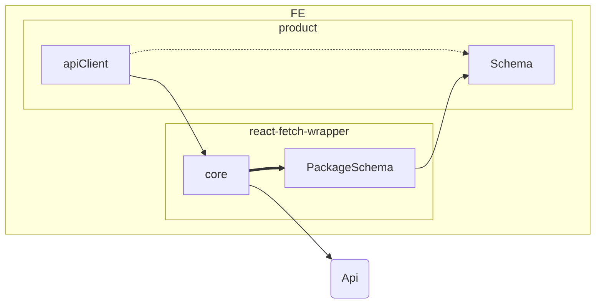

```mermaid
graph LR
  Api(Api)

  subgraph FE
    direction LR

    subgraph package[react-fetch-wrapper]
      PackageSchema
      core ==> PackageSchema
    end

    subgraph product
      Schema
      apiClient
    end

    PackageSchema --> Schema
    apiClient --> core
    apiClient -.-> Schema
  end

  core --> Api
```
